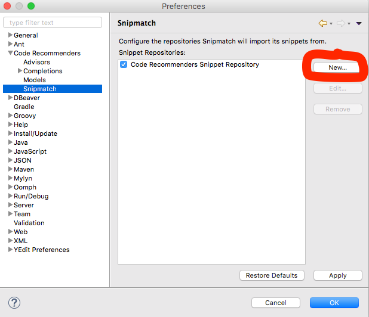
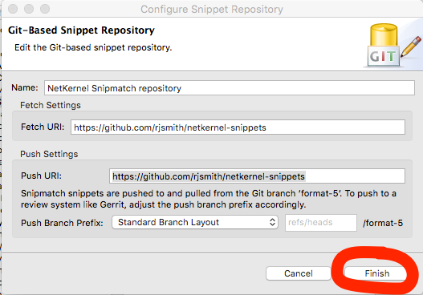
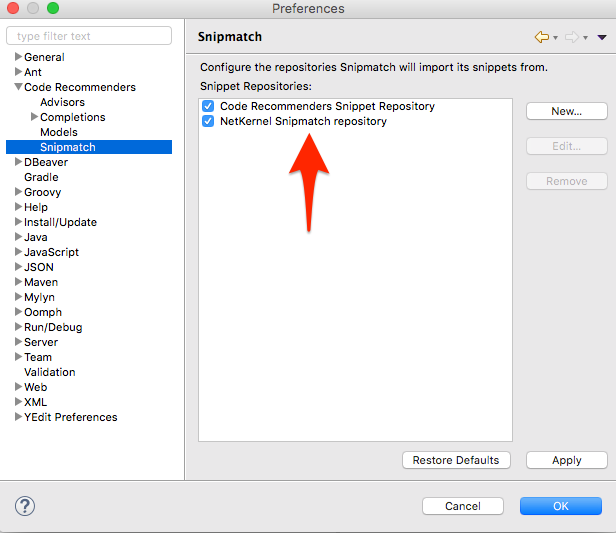

# netkernel-snippets

This is an [Eclipse Code Recommender Snipmatch](http://www.eclipse.org/recommenders/manual/#snipmatch) Snippet repository for [NetKernel](http://1060research.com/products/#netkernel) by [1060 Research Ltd.](http://1060research.com/).

This repository can be used to provide pre-defined code and xml snippets for NetKernel modules in the Eclipse IDE.

## Installation

Eclipse Code Recommenders comes pre-installed in every Eclipse release since the [Mars](https://www.eclipse.org/mars/) release in 2015.

You need to configure your Eclipse workspace to download snippets from this repository hosted on github.com:

Open the _Preferences_ -> _Code Recommenders_ -> _Snipmatch_ preference page and click the **New** button.

Select _Git-Based Snippet Repository_ from the list of Snippet Repository Types and click the **Next >** button.

Fill in the configuration form exactly as shown above and click the **Finish** button.

This repository is now set up correctly.

## Use

Please take a moment to read these [general instructions on how to use Eclipse Snipmatch](http://www.eclipse.org/recommenders/manual/#snipmatch) if you are not familiar with it.

Press `Ctrl + Alt + Space` in a Java or XML editor in Eclipse to open the Snipmatch search box view. Search for a NetKernel snippet by name or keyword. Or view all NetKernel snippets by searching for the `netkernel` tag by typing `tag:netkernel` in the search box.

## Contributions

Please raise an issue in the [repository issues list](https://github.com/rjsmith/netkernel-snippets/issues) to suggest a new snippet idea.

Or, even better, fork this repository, commit a new snippet definition then [send a pull request](https://help.github.com/articles/creating-a-pull-request-from-a-fork/)!

Please note that Snipmatch repositories have a [specific branch structure](http://www.eclipse.org/recommenders/manual/#snippet-repository-creation-guide) that must be adhered to in order to work properly in Eclipse.

## License

The contents of this repository are provided under the MIT license. See [LICENSE](LICENSE) for more details.

