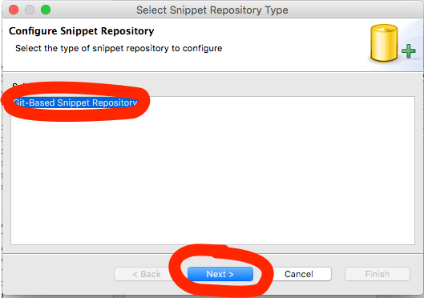

# netkernel-snippets

This is an [Eclipse Code Recommender Snipmatch](http://www.eclipse.org/recommenders/manual/#snipmatch) Snippet repository for [NetKernel](http://1060research.com/products/#netkernel) by [1060 Research Ltd.](http://1060research.com/).

This repository can be used to provide pre-defined code and xml snippets for NetKernel modules in the Eclipse IDE.

## Installation

Eclipse Code Recommenders comes pre-installed in every Eclipse release since the [Mars](https://www.eclipse.org/mars/) release in 2015.

Open the _Preferences_ -> _Code Recommenders_ -> _Snipmatch_ preference page and click the **New** button:

Select _Git-Based Snippet Repository_ from the list of Snippet Repository Types and click the **Next >** button:

Fill in the configuration form exactly as shown below and click the **Finish** button:

This repository is now set up correctly, click the **OK** button:

## Use

Please take a moment to read these [general instructions on how to use Eclipse Snipmatch](http://www.eclipse.org/recommenders/manual/#snipmatch) if you are not familiar with it.

Press `Ctrl + Alt + Space` in a Java or XML editor in Eclipse to open the Snipmatch search box view. Search for a NetKernel snippet by name or keyword. Or view all NetKernel snippets by searching for the `netkernel` tag by typing `tag:netkernel` in the search box.

## Contributions

Please raise an issue in the [repository issues list](https://github.com/rjsmith/netkernel-snippets/issues) to suggest a new snippet idea.

Or, even better, fork this repository, commit a new snippet definition then [send a pull request](https://help.github.com/articles/creating-a-pull-request-from-a-fork/)!

Please note that Snipmatch repositories have a [specific branch structure](http://www.eclipse.org/recommenders/manual/#snippet-repository-creation-guide) that must be adhered to in order to work properly in Eclipse.

## Authoring a new snippet

The process is that you create and test a snippet locally, then upload it to a configured Snipmatch repository.

Select the _Window_ -> _Show View_ -> _Other..._ menu option then select the _Code Recommenders_ -> _Snippets_ View.  NB: Do **not** select the identically-named _General_ -> _Snippets_ view by mistake:

In the **Snippets** View, select the "NetKernel Snippets repository" repo (as configured in the [Installation](#Installation) section above):

Right click on the "NetKernel Snippets repository" folder and select the **Add Snippet to...** context menu entry:

The Snipmatch Snippet Editor is now displayed. Fill in the meta data similar to the example in the screenshot below.  Don't forget the `netkernel` tag. For more information on how to use this editor, see the [Eclipse.org Snipmatch Editor documentation](http://www.eclipse.org/recommenders/manual/#snipmatch-editor):

Click on the **Raw Source** tab at the bottom of the Snippet Editor. This is where you add the actual code for the snippet.  If you adding Java code, you can also select existing code from a Java Editor, right-click and select the **Create Snippet...** option. Take a look at the [Raw Source](http://www.eclipse.org/recommenders/manual/#snipmatch-editor-source) documentation for more information and links to the JFace template language used by Snipmatch:

Hit Ctrl+S in the Snippet Editor to save the newly-defined snippet.  It is now available to try out in your Eclipse editor.

When you are happy that the snippet is working as you desire, if you have write permission to the configured NetKernel Snippets repository, you can upload it directly from the Snippets View.  Locate the newly - created snippet in the Snippets View, right-click and select **Share Snippet(s)...** (NB: you can multi-select more than one snippet to upload in one commit):

Fill in the commit details on the **Commit Changes** window then click the **Commit** button:

You will then be prompted with the url of the repository (should be filled in for you), enter your username and password credentials for the git repository and click the **OK** button:

If the commit was successful, you will see this final message:

## License

The contents of this repository are provided under the MIT license. See [LICENSE](LICENSE) for more details.

